# NexDR (Nex Deep Research)

<div align="center">

**NexDR** is an advanced deep research agent built on the [Nex-N1](https://huggingface.co/nex-agi/DeepSeek-V3.1-Nex-N1) agentic model and the [NexAU](https://github.com/nex-agi/nexau) agent framework. It autonomously decomposes research tasks, conducts parallel investigations, and generates structured research reports or visually rich presentation slides.

[](https://www.python.org/downloads/)
[](LICENSE)

English | [简体中文](README.zh.md)

</div>

---

## 🏆 Leading Performance

In the [DeepResearch Bench](https://huggingface.co/spaces/muset-ai/DeepResearch-Bench-Leaderboard) evaluation, NexDR's comprehensive performance **surpasses OpenAI Deep Research**, demonstrating leading advantages in information accuracy, report structure, and multimodal visualization capabilities.

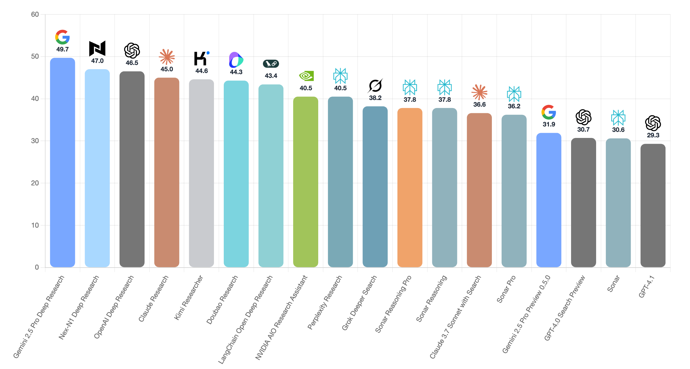

---

## 📦 Installation

### Prerequisites

- Python 3.12 or higher
- pip or uv package manager

### Using uv (recommended)

```bash
# Clone the repository
git clone https://github.com/nex-agi/NexDR.git
cd NexDR

# Install with uv
uv sync
```

### Using pip

```bash
# Clone the repository
git clone https://github.com/nex-agi/NexDR.git
cd NexDR

# Install dependencies
pip install -e .
```

### Environment Setup

Create a `.env` file in the project root with your API keys:

```bash
# Required for LLM capabilities (required)
LLM_API_KEY=your_openai_api_key_here
LLM_BASE_URL=your_openai_base_url_here
LLM_MODEL=model_name_you_used

# For web search and Serper document scraping (required)
SERPER_API_KEY=your_serper_api_key_here

# For document parsing (choose at least one provider)
JINA_API_KEY=your_jina_api_key_here
DOC_READER_PROVIDERS=jina,serper

# For Langfuse tracing (optional)
LANGFUSE_PUBLIC_KEY=your_langfuse_public_key
LANGFUSE_SECRET_KEY=your_langfuse_secret_key
LANGFUSE_HOST=https://cloud.langfuse.com
```

---

## 🚀 Quick Start

### Basic Usage

Run a research task and generate a markdown report:

```bash
python quick_start.py \
  --query "What are the latest developments in quantum computing?" \
  --report_format markdown \
  --output_dir workspaces/my_research
```

Generate an HTML presentation instead:

```bash
python quick_start.py \
  --query "Analyze the impact of AI on healthcare" \
  --report_format html \
  --output_dir workspaces/healthcare_research
```

### Command-Line Arguments

- `--query`: Your research question (required)
- `--report_format`: Output format - `markdown` or `html` (default: `markdown`)
- `--output_dir`: Directory to save results (default: `workspaces/workspace_TIMESTAMP`)

### Output Structure

After running a research task, your workspace will contain:

```
workspaces/my_research/
├── logs_TIMESTAMP.log           # Detailed execution logs
├── markdown_report.md           # Research report (if markdown format)
├── citations.json               # Citation references (if markdown format)
├── html_report.html            # HTML presentation (if html format)
└── final_state.json            # Execution metadata and statistics
```

### Demo App

```bash
uv run streamlit run demo_app.py
```

---

## 📸 Demo: Presentation Slide Generation

<div align="center">

### Research Query

> **"Please conduct an in-depth analysis of the success of *Black Myth: Wukong*, covering all aspects including development, release, and reviews, and create a presentation report."**

### Generated HTML Slides

<table>
  <tr>
    <td width="50%">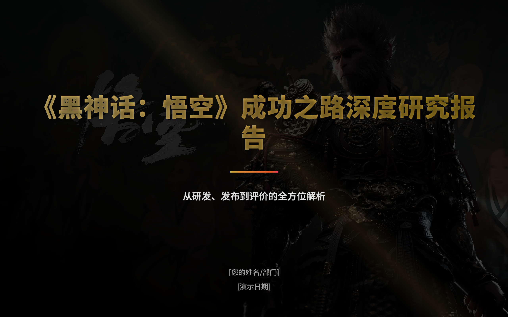</td>
    <td width="50%">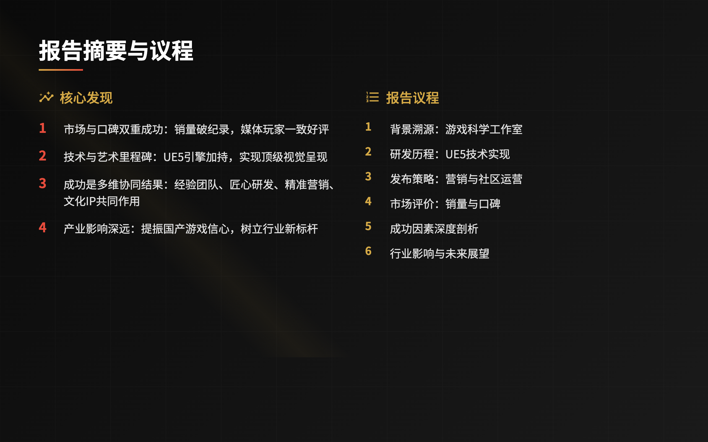</td>
  </tr>
  <tr>
    <td width="50%">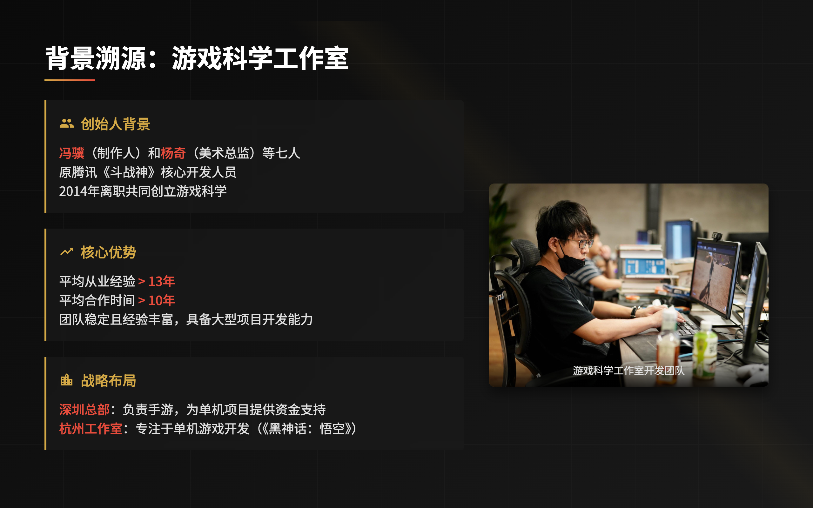</td>
    <td width="50%">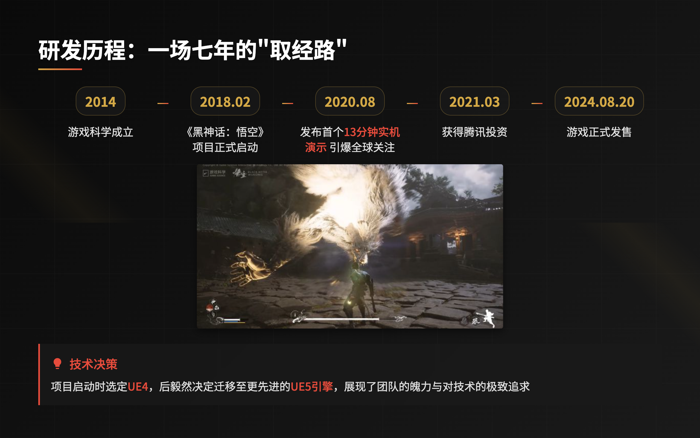</td>
  </tr>
  <tr>
    <td width="50%">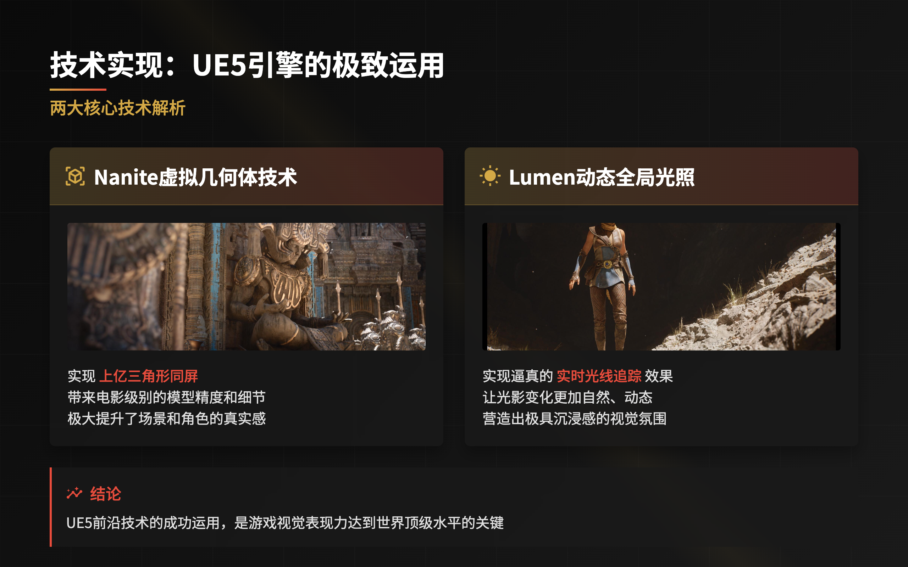</td>
    <td width="50%">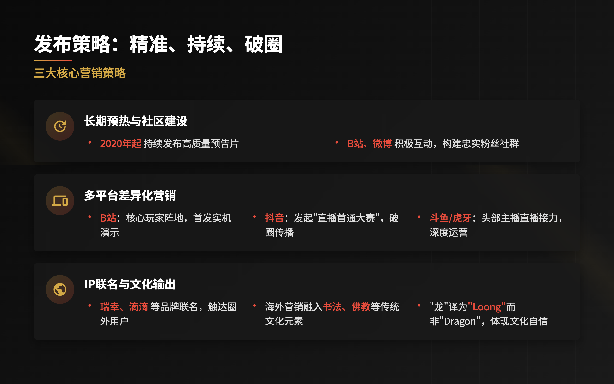</td>
  </tr>
  <tr>
    <td width="50%">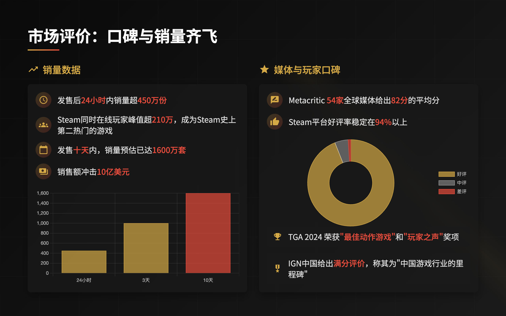</td>
    <td width="50%"></td>
  </tr>
  <tr>
    <td width="50%">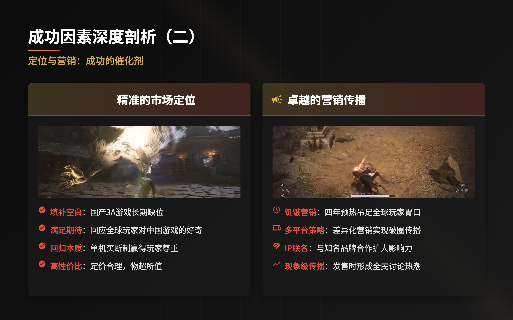</td>
    <td width="50%">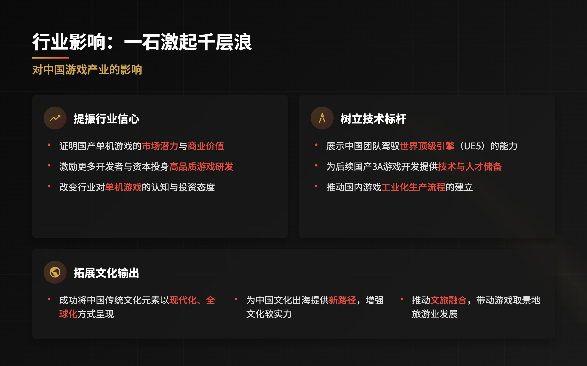</td>
  </tr>
  <tr>
    <td width="50%">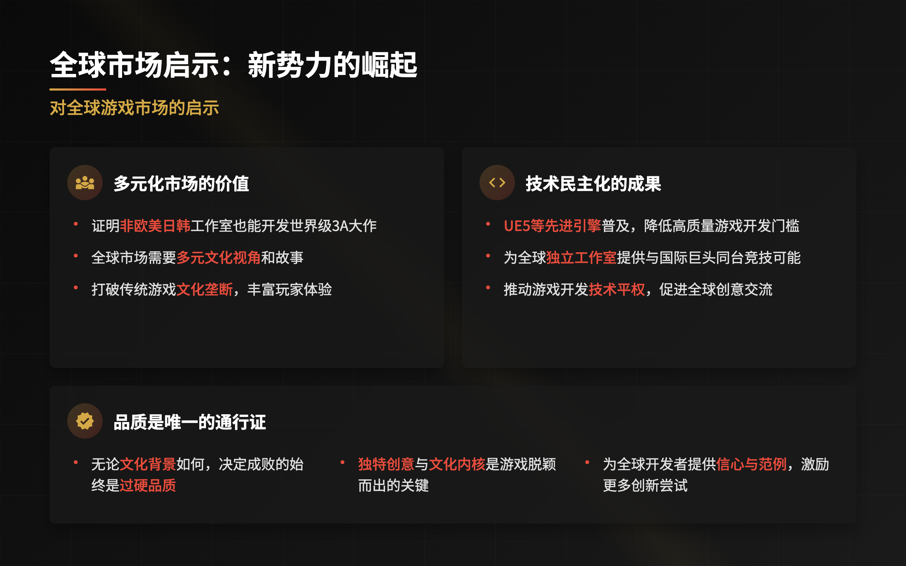</td>
    <td width="50%">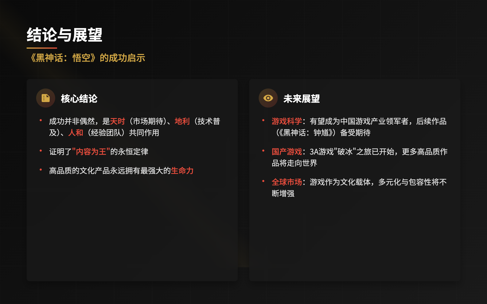</td>
  </tr>
  <tr>
    <td colspan="2"></td>
  </tr>
</table>

</div>

---

<div align="center">

**⭐ If you find NexDR useful, please consider giving it a star on GitHub! ⭐**

</div>
